# AlgoTrading Engine

A polyglot, event-driven algorithmic trading platform for Indian equity and
derivatives markets. A .NET 10 backend owns persistence, risk and broker
integration; a Python engine owns live ingestion and strategy execution; Redis
Streams carry ticks between them; TimescaleDB stores the time series; and a
React **web console** operates the whole thing from the browser — live feeds and
historical data, strategy runs and backtests, risk and alerts, the data vendors
and brokers it connects to, and who on the team may do what.

> **Trading involves financial risk.** This software is provided for research
> and educational use. Run it in paper/simulation mode until you have validated
> it end to end. See [LICENSE](LICENSE) and [SECURITY.md](SECURITY.md).

**In one minute**

- **What it is:** a trading desk for Indian index and commodity options, from
  the market data to the paper order: a .NET API, a Python strategy engine and
  a React console, running on one server.
- **What runs every trading day, unattended:** the data vendor signs itself in,
  the morning job deploys each account's plan of strategies and reports how
  many are live, the strategies trade on paper with statutory charges counted,
  and a rules-based watchman opens an incident when something breaks.
- **What is not proven:** no strategy here has shown an edge after costs. The
  research that says so is in [What I found](#what-i-found), with its method.
  Everything runs on paper.

---

## The console

Everything below is driven from the browser; there is no separate admin tool.

The console is six workspaces along the top: **Desk** (today on one sheet),
**Markets** (the chain, charts, movers, flows and news), **Trade** (runs, the
strategy library, history, orders and risk), **Research** (backtests, forecasts,
the filter lab and notebooks), **Data** (feeds, stored history, instruments) and
**System** (health, checkups, incidents, logs, connectors and people). An
**admin** sees all six. A **trader** sees the workspaces their module grants
allow, and only their own runs inside them. That split is enforced by the API,
not by hiding menu items: a trader calling an admin endpoint directly is
refused.

The screenshots are this deployment's own data, exported from the server on
Sunday 27 September 2026 and replayed into the console; the trading day on the
Desk is Friday 25 September, the last session with runs. Strategy names are
hidden behind letters (Strategy A, B, …); every number is the one the console
showed.

### The Desk

**Desk** — the page both consoles open on, and the one kept open all day. Each
account's result after charges, the runs grid (strategy by underlying, net of
charges), the day's P&L by account and by strategy, the latest checkup, what is
held overnight, the week's events, FII and DII flows, and the indices with their
option levels. The sheet reorders itself at the open and at the close; the
buttons above it show any part of the day. On a weekend it opens on the last day
with runs and says so.

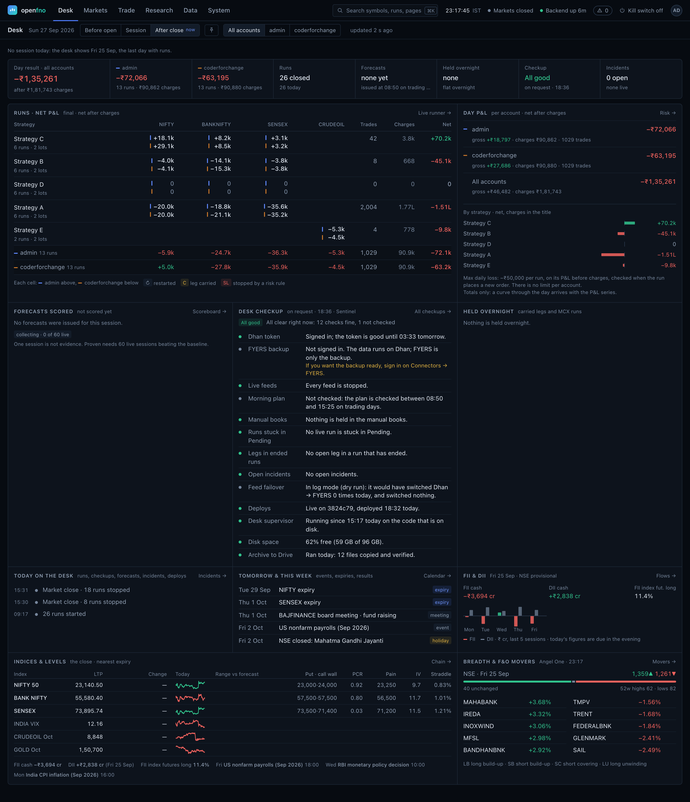

**On a phone** — the same sheet in one column. The runs grid keeps its
columns; the workspaces move to a tab bar at the bottom.

<p align="center">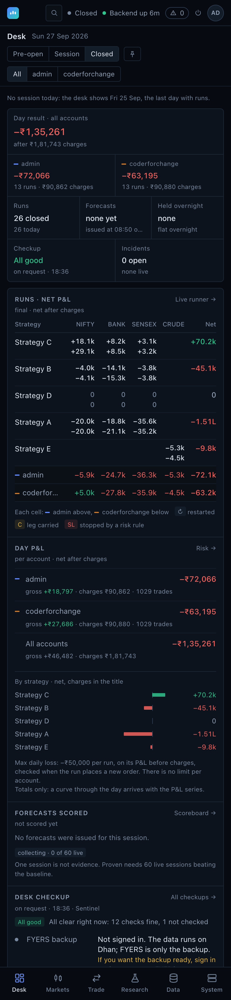</p>

**A trader's Desk** — the same page for a trader. The API answers with their
own runs and nothing else, so the sheet is their day: their result after
charges, their runs, their charges, and no admin panels.

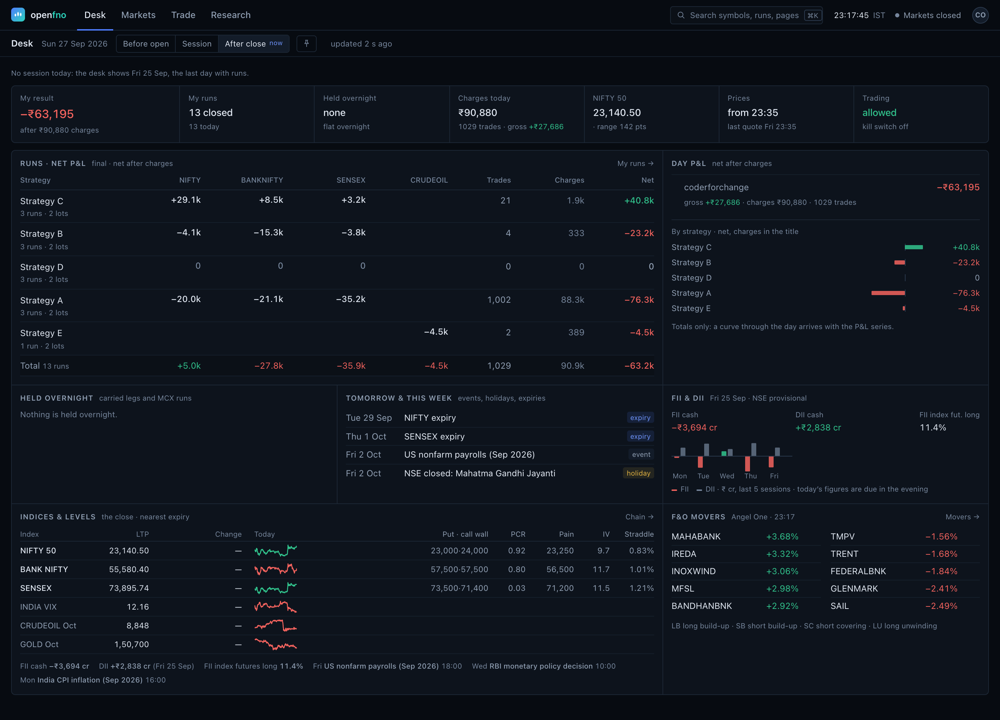

**⌘K** — one search box for pages, symbols, strategies and today's runs, on
every screen. It lists only what the viewer may open.

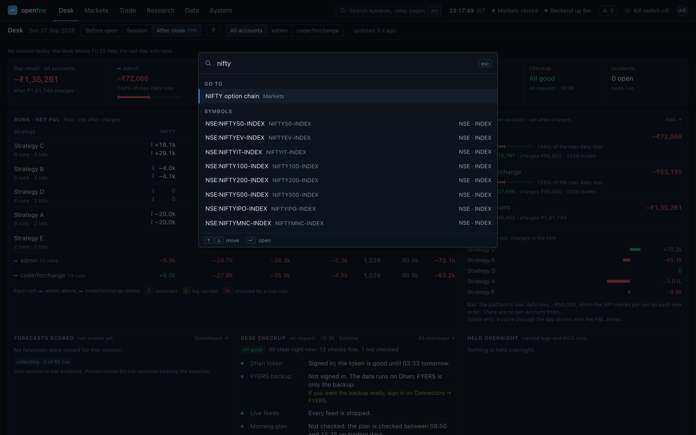

### Markets

**Option chain** — calls left, puts right, strike in the middle: open interest
and its change, volume, IV, LTP and what each pair means (long build-up, short
covering and so on). Every chain is stamped with when it was captured and by
which vendor, and the same chain can be rebuilt for any stored minute. Below
it, open interest by strike and the put-call ratio through the session.

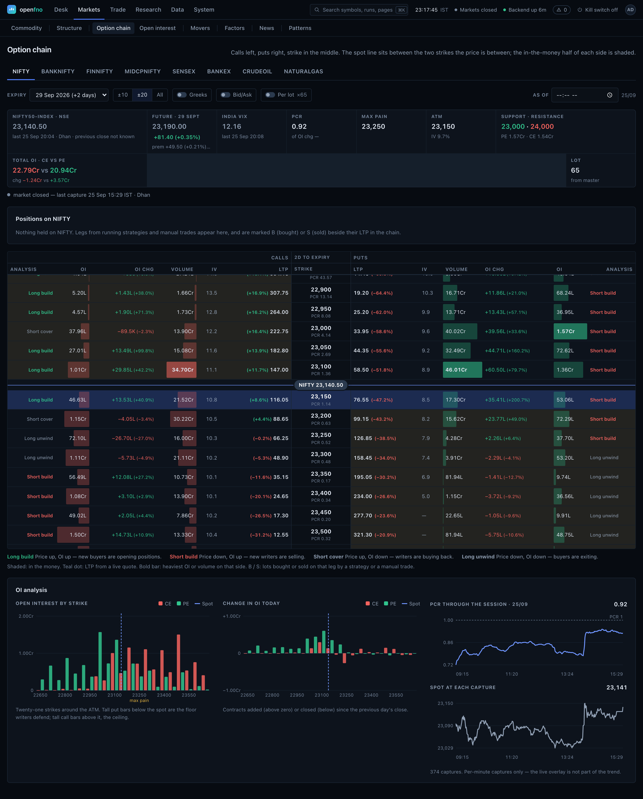

**Flows** — FII, DII, pro and client positions in index futures, the FII long
share over recent sessions, and cash-market buying and selling. Each section
says how fresh it is and what our own testing found; here, that nothing has
been tested yet.

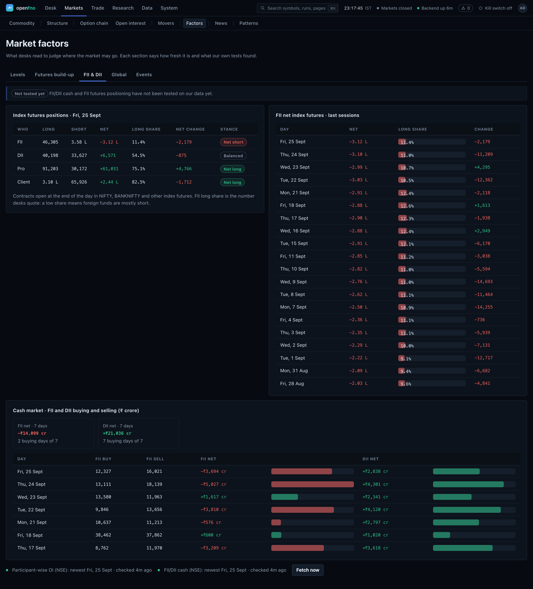

### Trade

**Run history** — every live run, attached to the account that started it, with
quantity as **lots × lot size**, net P&L after charges, and the reason it
stopped. Nothing is dismissed: a run stopped by a risk rule, by the close, by
hand or by a restart is still here.

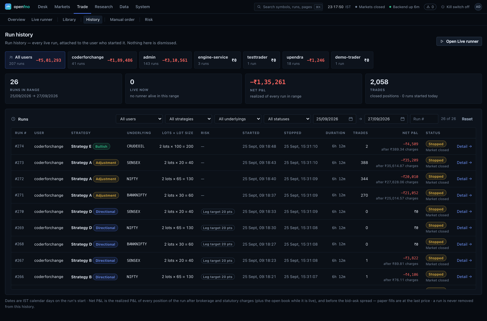

### Research

**Backtests** — coverage first. Before offering a backtest the console says
what history it holds per index and resolution, where it came from (`live` bars
the ingestor recorded, or a `backfill`), and what is missing. A backtest you
cannot run is better than one that quietly replays a gap.

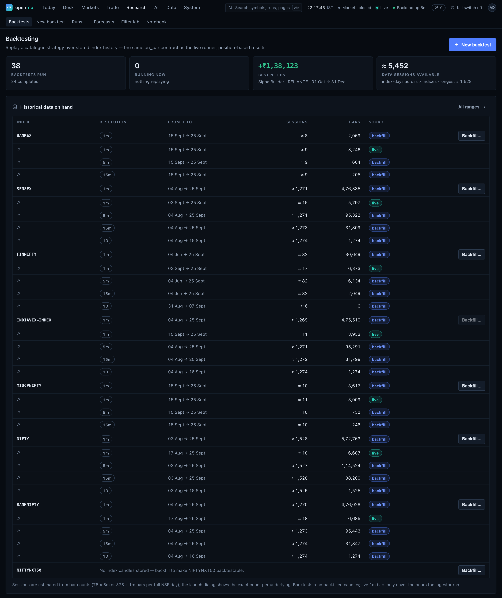

**Forecasts** — four models forecast the day's range, trend and direction
before the open, and every forecast is scored after the close. The scoreboard
judges a model on live forecasts only; its backtest is shown beside it as
history, not proof. None has a live score yet.

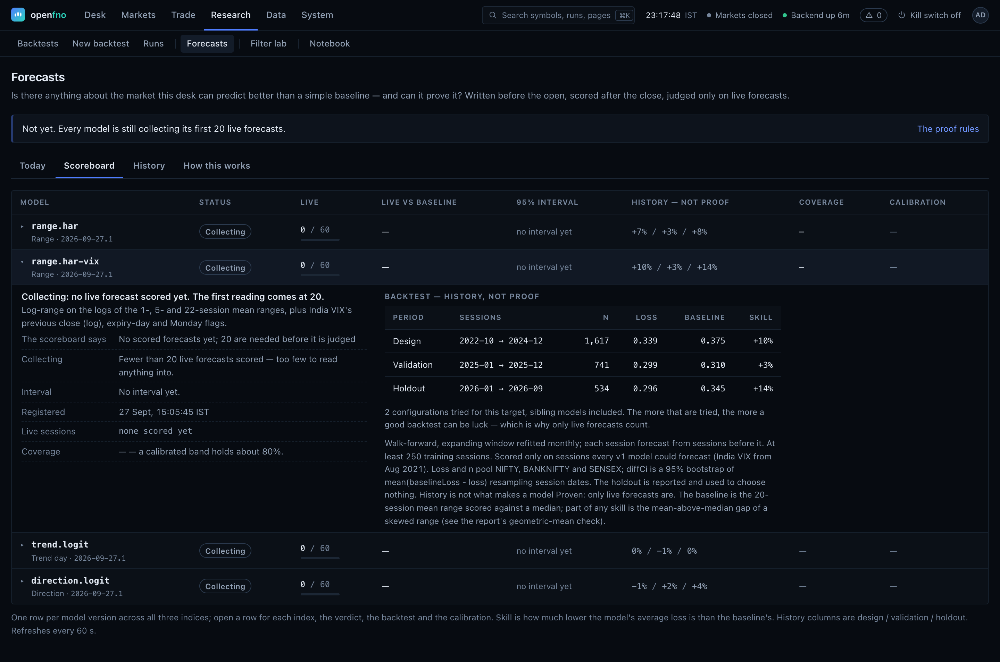

### System

**Checkup** — Sentinel, the desk's watchman, writes a checklist before the
open, after the close, at the end of the day and weekly, each item with what to
do about it. This one is the weekly review. A checkup only reads the desk.

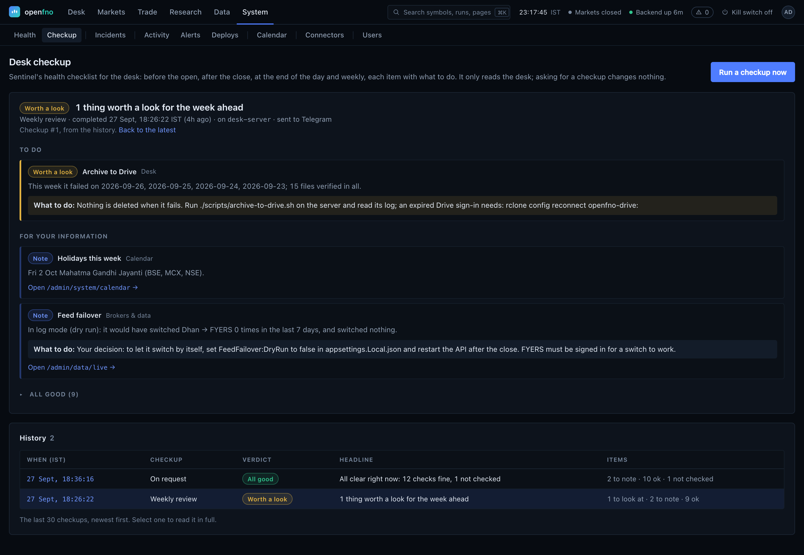

**Incidents** — each problem is one row however often it is seen, and the
history keeps what caused it and what fixed it. The row opened here is the
morning archive to Google Drive, which failed every day from 23 September until
Sentinel's first scan of the logs caught it on the 27th.

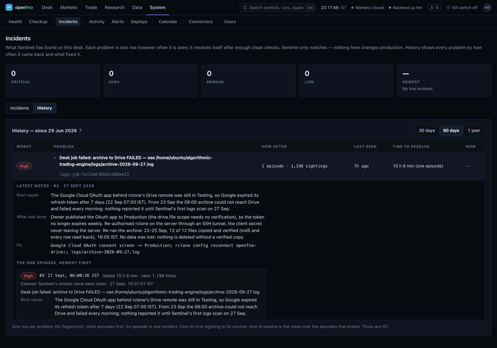

---

## What I found

The platform is built to say when its own numbers should not be trusted. That
applied to the ideas it was built to test as well.

### Research: no edge, and it is written down

Every test below uses real one-minute option premiums, slippage and statutory
charges, a design period fixed before any result was read, and a later period
held back and looked at once.

- **Intraday at-the-money option buying** on NIFTY, BANKNIFTY and SENSEX, two
  years of premiums: four candidate rules (trend, opening range, VWAP pullback,
  regime momentum) lost on all three indices even before costs. A feature screen
  passed 13 of 885 cells on gross returns, which is what chance gives, and none
  after costs.
- **Technical signals** on NIFTY option buying: 150 configurations of moving
  averages, VWAP, opening range, Supertrend, RSI, MACD, put/call shifts, 61
  candlestick patterns and 12 chart patterns. None passed.
- **Market structure** (break of structure and change of character, the "smart
  money" reading of a chart): on the index alone, a break moves NIFTY no more
  than an average candle. A counter-trend variant that looked good on 2024-26
  lost on the untouched 2020-23 period; over six years and 793 trades it was
  break-even at best.
- **Machine learning** (logistic regression and boosted trees, walk-forward):
  0 of 8 configurations passed, with a test AUC of 0.50-0.56.
- **Paper against costs:** one live paper day that showed a five-figure "net"
  profit was a six-figure loss once statutory charges and the spread were
  counted. Live P&L has been reported net of charges since.

### Operations: the desk's own failures, and what each one changed

The desk runs unattended, so most of its code exists because something went
wrong on a real morning. Each fix below is pinned by a test.

- **A rate limiter killed most of a morning.** At the open on 24 Sep the sign-in
  limiter refused 16 of 26 strategy runners; they died within seconds and
  nothing said so until 11:20. Runners now wait out a refusal, local calls have
  their own limit, and the morning job counts live runs against the plan and
  sends the answer to Telegram.
- **A strategy that never traded.** A market-structure reader was fed the live
  window by position; once the 500-bar window was full it froze. It is fed by
  candle time now.
- **A deploy that broke the feed.** A restart in the middle of the session cut
  the data feed. No build or API restart now happens while runs are live on a
  weekday.
- **A dead token reported as authenticated** left strategies deaf for a morning.
  Every token is now judged by its own expiry, and the data vendor's token is
  taken by the desk itself each morning, never replaced mid-session.
- **Ten-day-old alert code.** An API restart adopted the running alert process,
  so it never picked up new code. It now restarts when its script changes.
- **Candles after the close.** Flat bars kept forming from the closing price
  until 20:00. A session guard now drops them at the source.

[Sentinel](docs/modules/sentinel.md), the desk's own watchman, now checks for
these every half minute with plain rules and no AI model, and attaches the
deploy, commit and log lines around each incident. Its first scan found the
generated settings file, which holds every secret, readable by every account on
the machine.

---

## Contents

- [What I found](#what-i-found)
- [The console](#the-console)
- [Architecture](#architecture)
- [Prerequisites](#prerequisites)
- [Quick start](#quick-start)
- [Connecting your broker account](#connecting-your-broker-account)
- [Running the system day to day](#running-the-system-day-to-day)
- [Project layout](#project-layout)
- [Configuration](#configuration)
- [Manual setup](#manual-setup-without-the-scripts)
- [Verifying the install](#verifying-the-install)
- [Troubleshooting](#troubleshooting)
- [Further documentation](#further-documentation)

---

## Architecture

```
   Dhan WebSocket   ┌──────────────────────┐
   (FYERS fallback) │  Python Engine       │
   ───────────────► │  live feed adapters  │
                    └──────────┬───────────┘
                               │ XADD market:ticks
                               ▼
                    ┌──────────────────────┐
                    │  Redis Streams       │
                    └──────────┬───────────┘
                               │ consumer group
                               ▼
   ┌───────────────┐  ┌──────────────────────┐   ┌──────────────────┐
   │ AlgoTrading   │  │ Worker.MarketData    │──►│ TimescaleDB      │
   │ .Api  :5025   │◄─┤ optional archive     │   │ (PostgreSQL 15)  │
   │ REST + Swagger│  └──────────────────────┘   └──────────────────┘
   └───────┬───────┘                                      ▲
           │ REST                                         │
           ▼                                              │
   ┌──────────────────────┐                               │
   │ Python strategies    │───────────────────────────────┘
   │ execution_runner     │  signals, paper orders, positions
   └──────────────────────┘

   ┌──────────────────────┐
   │ Web console (React)  │  dev :5173, or served by the API from wwwroot
   │ admin + trader       │──► AlgoTrading.Api REST (polling)
   └──────────────────────┘

   Observability:  Prometheus :9090  ──►  Grafana :3000
```

| Component | Stack | Responsibility |
|---|---|---|
| `AlgoTrading.Api` | .NET 10 | REST API, auth and access control, instruments, expiry resolution, simulation, risk, and the connector registry that decides which vendor serves which job; serves the built web console from `wwwroot` |
| `AlgoTrading.Worker.MarketData` | .NET 10 | Optional: drains the Redis tick stream into the `market_ticks` archive, with retries and a dead-letter stream (the API stores live ticks itself) |
| `AlgoTrading.Worker.Strategy` | .NET 10 | Strategy host (placeholder — live strategies run in the Python engine) |
| `AlgoTrading.PythonEngine` | Python 3.10+ | Live ingestion (Dhan, with FYERS as the fallback), option-chain tracking, strategy execution, and Sentinel, the rules-based watchman |
| `web/` | React 19 + Vite + TypeScript | Web console: the admin modules plus the trader screens |

The .NET solution follows a clean-architecture split: `Domain` → `Application`
→ `Infrastructure` → `Api`/`Worker.*`, with `Contracts` holding the DTOs shared
across boundaries.

FYERS is one **connector**, not the platform's wiring: data vendors and brokers
sit behind `IMarketDataProvider` and `IBrokerProvider`, each declaring what it can
actually deliver, and every stored price records which connector produced it. See
[docs/modules/connectors_module.md](docs/modules/connectors_module.md).

---

## Prerequisites

The same four tools on every operating system:

| Tool | Version | Check | Install |
|---|---|---|---|
| Docker Desktop | any current | `docker --version` | <https://www.docker.com/products/docker-desktop/> |
| Docker Compose | v2+ | `docker compose version` | bundled with Docker Desktop |
| .NET SDK | **10.0+** | `dotnet --version` | <https://dotnet.microsoft.com/download/dotnet/10.0> |
| Python | **3.10+** | `python3 --version` | <https://www.python.org/downloads/> |

Plus a [FYERS](https://myapi.fyers.in/dashboard) account and API app if you want
live market data. The infrastructure and API start fine without one.

<details>
<summary><b>Platform install shortcuts</b></summary>

**macOS** (Homebrew)
```bash
brew install --cask docker
brew install dotnet python@3.12
```

**Windows** (winget, in an elevated PowerShell)
```powershell
winget install Docker.DockerDesktop
winget install Microsoft.DotNet.SDK.10
winget install Python.Python.3.12
```

**Ubuntu / Debian**
```bash
# Docker
curl -fsSL https://get.docker.com | sh
sudo usermod -aG docker "$USER"   # log out and back in afterwards

# .NET 10 SDK
curl -fsSL https://dot.net/v1/dotnet-install.sh | bash -s -- --channel 10.0
export PATH="$HOME/.dotnet:$PATH"

# Python
sudo apt-get install -y python3 python3-venv python3-pip
```

**Arch**
```bash
sudo pacman -S docker docker-compose dotnet-sdk python python-virtualenv
```
</details>

---

## Quick start

Three steps, and the only difference between operating systems is the script
extension.

### 1. Clone and bootstrap

<table>
<tr><th align="left">macOS · Linux · WSL · Git Bash</th></tr>
<tr><td>

```bash
git clone https://github.com/helloupendra/algorithmic-trading-engine.git
cd algorithmic-trading-engine
./scripts/setup.sh
```

</td></tr>
<tr><th align="left">Windows (PowerShell)</th></tr>
<tr><td>

```powershell
git clone https://github.com/helloupendra/algorithmic-trading-engine.git
cd algorithmic-trading-engine
.\scripts\setup.ps1
```

If PowerShell blocks the script, allow local scripts for your user once:
```powershell
Set-ExecutionPolicy -ExecutionPolicy RemoteSigned -Scope CurrentUser
```

</td></tr>
</table>

`setup` is idempotent — re-run it any time. It will:

1. verify all four prerequisites and print install links for anything missing;
2. create `.env` from `.env.example`, generating a random JWT signing key and
   Postgres password on first run;
3. start PostgreSQL/TimescaleDB, Redis, Prometheus and Grafana, then **wait for
   their health checks** rather than guessing with a sleep;
4. generate the git-ignored `appsettings.Local.json` files from `.env`;
5. download the current FYERS instrument masters into `data/instruments/`;
6. `dotnet restore` + `dotnet build`;
7. create `.venv` and install the Python dependencies.

Useful flags: `--refresh` / `-Refresh` re-downloads the instrument masters,
`--skip-build` / `-SkipBuild` skips the .NET build.

### 2. Start the API

Leave this running — it applies the EF Core migrations on boot, so the schema
is created here, not by a separate migration step.

```bash
dotnet run --project src/AlgoTrading.Api
```

Swagger comes up at **<http://localhost:5025/swagger>**.

### 3. Load reference data

In a second terminal:

```bash
./scripts/load-data.sh          # macOS / Linux / WSL
.\scripts\load-data.ps1         # Windows
```

This waits for the API, seeds the derivative expiry calendars, and imports both
instrument masters (~100,000 contracts). Also idempotent.

---

## Connecting your broker account

Live data needs a FYERS app and a daily access token.

1. Create an app at <https://myapi.fyers.in/dashboard>. Set its redirect URI to
   exactly `http://127.0.0.1:5025/api/auth/callback`.
2. Put the credentials in `.env`:
   ```ini
   FYERS_APP_ID=ABCD1234XY-100
   FYERS_SECRET_KEY=YOURSECRET
   ```
3. Regenerate the .NET config and restart the API:
   ```bash
   python3 scripts/_gen_local_settings.py
   ```
4. Open <http://localhost:5025/api/auth/start> in a browser and complete the
   FYERS login. The callback stores the access token in the `broker_sessions`
   table, where both the API and the Python engine read it from.

FYERS access tokens expire daily, so step 4 is a once-a-day action.

---

## Running the system day to day

Each of these wants its own terminal.

| # | What | Command |
|---|---|---|
| 1 | Infrastructure | `docker compose up -d` |
| 2 | API | `dotnet run --project src/AlgoTrading.Api` |
| 3 | Web console (dev) | `cd web && npm run dev` → <http://localhost:5173> |
| 4 | Python engine (optional CLI) | `python src/AlgoTrading.PythonEngine/algo.py` |

`AlgoTrading.Worker.MarketData` is **not** a step: the feeds post every tick to
the API and the API stores it, which is why `scripts/go-live.sh` starts only the API.
The worker only keeps a second copy in `market_ticks`, which the API stopped
writing on 15 Sep (see `docs/modules/data_module.md`, "When a tick does not
arrive").

Day-to-day operation is designed to happen **from the web console**: sign in as
admin, connect FYERS under *Broker*, then use the **Data module** —
*Live feeds* starts/stops the ingestor and manages the watchlist,
*Historical* browses coverage and backfills candles from FYERS,
*Instruments & F&O* explores the contract universe. The `algo.py` menu remains
as a terminal fallback for the same operations.

To serve the console from the API itself (one origin, no dev server), run
`./scripts/go-live.sh` — it builds `web/` with relative URLs, copies it into
`src/AlgoTrading.Api/wwwroot`, starts the API and opens a Cloudflare quick
tunnel.

Before running anything Python, activate the virtualenv and set `PYTHONPATH` —
the engine uses absolute package imports, so it will not resolve without it:

```bash
# macOS / Linux
source .venv/bin/activate
export PYTHONPATH="$PWD/src/AlgoTrading.PythonEngine"
```
```powershell
# Windows
.\.venv\Scripts\Activate.ps1
$env:PYTHONPATH = "$PWD\src\AlgoTrading.PythonEngine"
```

`algo.py` is an interactive control centre covering the common operations:

```
[1] Start Live Data Ingestor       [6] Clear Entire Watchlist
[2] Open Live Prices Monitor       [7] Start Live Strategy Runner
[3] Add Single Stock to Watchlist  [8] Open Live Strategy Dashboard
[4] Add Equity Group to Watchlist  [9] Exit
[5] Add Option Chain to Watchlist
```

The underlying scripts can also be driven directly:

```bash
# Live tick ingestion from FYERS into Redis + the API
python src/AlgoTrading.PythonEngine/market_data/live/fyers_streamer.py

# Record the ATM option chain during market hours (09:15–15:30 IST)
python src/AlgoTrading.PythonEngine/market_data/options/chain_tracker.py

# Run a strategy
python src/AlgoTrading.PythonEngine/strategies/execution_runner.py \
    --strategy ExampleStraddle --user-id 1

# Live PnL / positions dashboard
python src/AlgoTrading.PythonEngine/tools/strategy_live_terminal_dashboard_v2.py \
    --user-id 1
```

Available strategies include `GhostTangentCrossings` (5m ellipse-tangent
breakout on BANKNIFTY/NIFTY/SENSEX), `LogicEngine` (15m rules + Telegram
alerts) and `ExampleStraddle`. Add your own as `BaseStrategy` subclasses in the
`strategies/` directory — they are auto-discovered.

The live ingestor is supervised for honesty: its heartbeat reports the real
websocket state (`Running` / `Stalled` / `Disconnected`), and a watchdog forces
a full reconnect with a fresh broker token if the socket stays down — so a
dead feed shows up as degraded in the console instead of silently freezing.
`GET /api/LiveData/bars` aggregates 5m/15m bars on read from the stored 1m
live bars.

### The web console

The console lives in `web/`. What each module does:

| Module | What it does |
|---|---|
| **Data** | *Overview* (coverage matrix, pipeline health, needs-attention), *Live feeds* (start/stop the ingestor, index tickers, the subscription list with quotes, diagnostics + process logs, tick/bar inspector), *Option chain* and *Open interest* (the priced strike ladder and its intraday OI curves), *Historical* (coverage-first candle browser with chart + backfill incl. ATM±N option chains), *Instruments & F&O* (master search, expiries, CE/PE chain ladder) |
| **Strategies** | Live runner (mandatory underlying, lots × lot size, three-level risk rules editable while running), run history per user, strategy library |
| **Backtesting** | Coverage-first launcher, replay over stored history on the same `on_bar` contract as the live runner, position-based results with skipped entries listed honestly |
| **Connectors** | Data vendors and brokers: capability matrix, credentials, sessions, a probe that fetches real bars, and the routing table that decides which source serves which job |
| **Users** | Accounts, server-enforced module grants, strategy packages with limits, invitations, sessions |
| **System** | Service health, the kill switch and trading limits, and the alerter |
| **Activity log** | Who did what, across every module: click an account to see where they have been, filter to refusals only ([notes](docs/modules/activity_log.md)) |
| **Trader screens** | What a trader sees, already narrowed by their module grants and strategy package |

Navigation lives in `web/src/lib/modules.ts`. There is no generic "Modules"
heading: every entry sits with the thing it belongs to — **Connectors** under
*Data*, because it is where the data comes from; **Users & access** under
*System*, alongside the kill switch and the alerter, because that is one question
an operator asks, not three.

**Access control is enforced on the server, not in the menu.** A trader without a
module grant gets `403` from the matching endpoints whether they use the console
or `curl`; a trader outside their strategy package is refused at deploy time with
the reason. Hiding a nav entry is not access control — anyone can type a URL.

### Service endpoints

| Service | URL | Credentials |
|---|---|---|
| Web console (dev) | <http://localhost:5173> | admin / trader accounts (see [web/README.md](web/README.md)) |
| Web console (served by API) | <http://localhost:5025> | same — deployed by `scripts/go-live.sh` |
| API + Swagger | <http://localhost:5025/swagger> | — |
| Prometheus metrics | <http://localhost:5025/metrics> | — |
| Grafana | <http://localhost:3000> | from `.env` (`admin`/`admin` by default) |
| Prometheus | <http://localhost:9090> | — |
| PostgreSQL/TimescaleDB | `localhost:5432` | from `.env` |
| Redis | `localhost:6379` | from `.env` |
| RedisInsight (optional) | <http://localhost:8001> | `docker compose --profile tools up -d` |

---

## Project layout

```
algorithmic-trading-engine/
├── docker-compose.yml           Infrastructure: TimescaleDB, Redis, Prometheus, Grafana
├── .env.example                 Configuration template — copy to .env
├── AlgoTrading.slnx             .NET solution
│
├── scripts/
│   ├── setup.sh / setup.ps1             One-command bootstrap
│   ├── load-data.sh / load-data.ps1     Expiry rules + instrument import
│   └── _gen_local_settings.py           .env -> appsettings.Local.json
│
├── src/
│   ├── AlgoTrading.Domain/          Entities and domain rules
│   ├── AlgoTrading.Application/     Use cases and interfaces
│   ├── AlgoTrading.Infrastructure/  EF Core, FYERS clients, services, migrations
│   ├── AlgoTrading.Contracts/       Request/response DTOs
│   ├── AlgoTrading.Api/             REST API (:5025), serves web console from wwwroot
│   ├── AlgoTrading.Worker.MarketData/  Redis -> TimescaleDB tick writer
│   ├── AlgoTrading.Worker.Strategy/    Strategy host (placeholder)
│   └── AlgoTrading.PythonEngine/
│       ├── algo.py                  Interactive control centre
│       ├── core/                    Config, API client, metrics
│       ├── market_data/
│       │   ├── live/                fyers_streamer.py — the live ingestor
│       │   ├── options/             ATM option-chain tracker
│       │   └── historical/          FYERS downloader, DB replayer
│       ├── messaging/               Redis stream publisher/subscriber
│       ├── strategies/              Base strategy, runner, Ghost, LogicEngine, Fulcrum
│       ├── state_management/        Strategy state persistence and recovery
│       └── tools/                   Monitors, dashboards, backfill CLIs
│
├── web/                         React web console
│   └── src/
│       ├── lib/                 api client, query hooks, module registry, symbols
│       ├── components/          shell, icons, charts, shared UI primitives
│       └── pages/
│           ├── data/            Data module: overview, live feeds, historical, F&O
│           ├── admin/           admin modules
│           └── trader/          trader screens
│
├── tests/                       Unit, integration and backtest projects
├── database/
│   ├── seed/                    Expiry-rule seed SQL
│   └── queries/                 Ad-hoc diagnostic queries
├── data/instruments/            Downloaded FYERS masters (git-ignored)
├── docker/                      Prometheus and Grafana provisioning
└── docs/                        Architecture, deployment and status docs
```

---

## Configuration

`.env` at the repo root is the single source of truth. Nothing else needs
editing.

```
.env  ──┬──►  docker-compose.yml                    (containers, read directly)
        ├──►  appsettings.Local.json                (generated by setup)
        │        └─► AlgoTrading.Api, Worker.MarketData
        └──►  core/config.py via python-dotenv      (Python engine)
```

After changing any .NET-facing value in `.env`, regenerate and restart:

```bash
python3 scripts/_gen_local_settings.py
```

### Key settings

| Variable | Purpose |
|---|---|
| `POSTGRES_USER` / `POSTGRES_PASSWORD` / `POSTGRES_DB` | Database credentials, used by both the container and the apps |
| `REDIS_HOST` / `REDIS_PORT` / `REDIS_PASSWORD` | Redis connection |
| `REDIS_STREAM_NAME` / `REDIS_STREAM_MAXLEN` | Tick stream name and memory cap |
| `FYERS_APP_ID` / `FYERS_SECRET_KEY` / `FYERS_REDIRECT_URI` | Broker API app |
| `JWT_SECRET_KEY` | API token signing key — must be 32+ characters |
| `RISK_MAX_ORDERS_PER_MINUTE` / `RISK_MAX_DAILY_LOSS` | Risk guardrails |

### What is committed and what is not

Committed `appsettings.json` files contain **placeholders only**. Real
credentials live in `.env` and the generated `appsettings.Local.json`, both of
which are git-ignored. Never move a secret into a tracked file.

> **If you change `POSTGRES_PASSWORD` after the database already exists**, the
> running container keeps its original password — Postgres only reads that
> variable when it initialises an empty data directory. Either change it back,
> or wipe the volume with `docker compose down -v` (this deletes all stored
> market data).

---

## Manual setup (without the scripts)

Should you prefer to drive each step yourself:

```bash
# 1. Configuration
cp .env.example .env          # Windows: Copy-Item .env.example .env
#    edit .env and fill in the values

# 2. Infrastructure
docker compose up -d
docker compose ps             # wait until timescaledb and redis are healthy

# 3. .NET configuration + build
python3 scripts/_gen_local_settings.py
dotnet restore AlgoTrading.slnx
dotnet build AlgoTrading.slnx

# 4. Instrument masters
mkdir -p data/instruments
curl -fL -o data/instruments/NSE_CM.csv https://public.fyers.in/sym_details/NSE_CM.csv
curl -fL -o data/instruments/NSE_FO.csv https://public.fyers.in/sym_details/NSE_FO.csv

# 5. Python environment
python3 -m venv .venv
source .venv/bin/activate                     # Windows: .\.venv\Scripts\Activate.ps1
pip install -r src/AlgoTrading.PythonEngine/requirements.txt

# 6. Start the API — this creates the schema via EF Core migrations
dotnet run --project src/AlgoTrading.Api

# 7. In a second terminal: seed and import
docker exec -i algotrading_db psql -U postgres -d algotrading < database/seed/001_expiry_rules.sql
curl -X POST http://localhost:5025/api/Instruments/import-local \
     -H "Content-Type: application/json" \
     -d "{\"filePath\":\"$PWD/data/instruments/NSE_CM.csv\"}"
curl -X POST http://localhost:5025/api/Instruments/import-local \
     -H "Content-Type: application/json" \
     -d "{\"filePath\":\"$PWD/data/instruments/NSE_FO.csv\"}"
```

---

## Verifying the install

```bash
# Containers healthy?
docker compose ps

# API up?
curl -fsS http://localhost:5025/swagger/index.html >/dev/null && echo "API OK"

# Instruments imported? (expect ~100,000)
docker exec -i algotrading_db psql -U postgres -d algotrading \
  -c 'SELECT COUNT(*) FROM instruments;'

# Expiry rules seeded? (expect 2)
docker exec -i algotrading_db psql -U postgres -d algotrading \
  -c 'SELECT "Exchange","Underlying" FROM expiry_rules;'

# .NET tests
dotnet test AlgoTrading.slnx

# Python engine tests (strategies, backtest replay, risk rules, feeds)
.venv/bin/python -m unittest discover -s src/AlgoTrading.PythonEngine/tests

# Web: types, bundle, unit tests and lint
cd web && npx tsc -b && npx vite build && npm test && npx oxlint src
```

---

## Troubleshooting

<details>
<summary><b>"Docker daemon is not running"</b></summary>

Start Docker Desktop (or `sudo systemctl start docker` on Linux) and wait for
it to report ready, then re-run the setup script.
</details>

<details>
<summary><b>Port already in use (5432, 6379, 3000, 5025)</b></summary>

Something else is bound to the port. Find it:

```bash
lsof -i :5432            # macOS / Linux
netstat -ano | findstr :5432   # Windows
```

Either stop that process, or change the port in `.env`
(`POSTGRES_PORT`, `REDIS_PORT`) and re-run setup. This repository previously
shipped containers named `algo_timescale` / `algo_redis`; if those are still
running from an older checkout, remove them with
`docker rm -f algo_timescale algo_redis`.
</details>

<details>
<summary><b>Password authentication failed for user "postgres"</b></summary>

The Postgres volume was created with a different password than the one now in
`.env`. Postgres only applies `POSTGRES_PASSWORD` when initialising an empty
data directory. Either restore the original password in `.env`, or reset the
volume — **this deletes all stored market data**:

```bash
docker compose down -v
docker compose up -d
```
</details>

<details>
<summary><b><code>ModuleNotFoundError: No module named 'core'</code></b></summary>

`PYTHONPATH` is not set. The engine uses absolute package imports:

```bash
export PYTHONPATH="$PWD/src/AlgoTrading.PythonEngine"        # macOS / Linux
$env:PYTHONPATH = "$PWD\src\AlgoTrading.PythonEngine"        # Windows
```
</details>

<details>
<summary><b><code>RuntimeError: FYERS_APP_ID is not set</code></b></summary>

Add `FYERS_APP_ID` (and `FYERS_SECRET_KEY`) to `.env`, then regenerate the .NET
config with `python3 scripts/_gen_local_settings.py` and restart the API.
</details>

<details>
<summary><b>"running scripts is disabled on this system" (Windows)</b></summary>

```powershell
Set-ExecutionPolicy -ExecutionPolicy RemoteSigned -Scope CurrentUser
```
</details>

<details>
<summary><b><code>bad interpreter: /bin/bash^M</code> (WSL / Git Bash)</b></summary>

The shell scripts were checked out with CRLF endings. `.gitattributes` pins
them to LF, so refresh the working tree:

```bash
git rm --cached -r . && git reset --hard
```
</details>

<details>
<summary><b>Instrument import returns <code>skipped</code> for every row</b></summary>

Not an error — the contracts are already in the database and unchanged. The
import is idempotent.
</details>

<details>
<summary><b>No ticks arriving</b></summary>

Work down the chain:
1. Indian markets are open 09:15–15:30 IST on weekdays.
2. FYERS access tokens expire daily — re-run
   <http://localhost:5025/api/auth/start> (or the console's *Broker* page).
   The ingestor's heartbeat now reports `Disconnected`/`Stalled` honestly, so
   the console topbar shows the feed as degraded when this happens.
3. Check the watchlist is not empty — console → *Data → Live feeds*, or
   `algo.py` option 3/4/5.
4. Check the ingestor process output: console → *Data → Live feeds → Feed
   diagnostics*, or `GET /api/Ingestor/logs`.
5. Confirm ticks are reaching Redis:
   `docker exec -it algotrading_redis redis-cli XLEN market:ticks`
6. Confirm ticks are being stored:
   `SELECT count(*) FROM live_ticks WHERE "ReceivedUtc" > now() - interval '5 minutes';`.
   The API writes them as the feed posts them — no worker process is needed. A
   feed whose batches the API refused says so in its heartbeat error and in
   `algotrading_feed_ticks_not_stored` on `/metrics`.
</details>

<details>
<summary><b>Resetting everything</b></summary>

```bash
docker compose down -v          # removes containers AND all data volumes
rm -rf .venv data/instruments/*.csv
./scripts/setup.sh
```
</details>

---

## Further documentation

| Document | Contents |
|---|---|
| [docs/01_ARCHITECTURE_OVERVIEW.md](docs/01_ARCHITECTURE_OVERVIEW.md) | Component responsibilities and data flow |
| [docs/02_LOCAL_DEPLOYMENT_GUIDE.md](docs/02_LOCAL_DEPLOYMENT_GUIDE.md) | Deployment detail beyond the quick start |
| [docs/03_ARCHITECTURE_AND_RISK_MANAGEMENT.md](docs/03_ARCHITECTURE_AND_RISK_MANAGEMENT.md) | Risk controls and safety design |
| [docs/RESEARCH_AND_ARCHITECTURE.md](docs/RESEARCH_AND_ARCHITECTURE.md) | Long-form design rationale and research notes |
| [docs/PROJECT_STATUS.md](docs/PROJECT_STATUS.md) | Current build status and roadmap |
| [CONTRIBUTING.md](CONTRIBUTING.md) | Development workflow and conventions |
| [SECURITY.md](SECURITY.md) | Vulnerability reporting and security practices |

### Module notes

| Document | Contents |
|---|---|
| [docs/modules/connectors_module.md](docs/modules/connectors_module.md) | Data vendors and brokers: the provider seam, capability matrix, routing and failover rules |
| [docs/modules/users_module.md](docs/modules/users_module.md) | Roles, server-enforced module grants, session control and invitations |
| [docs/modules/strategy_packages.md](docs/modules/strategy_packages.md) | What a trader may run and the ceilings that come with it |
| [docs/modules/strategies_module.md](docs/modules/strategies_module.md) | Live runner: lots × lot size, risk levels, multi-instance runs |
| [docs/modules/backtesting_module.md](docs/modules/backtesting_module.md) | Replay engine and the coverage-first launcher |
| [docs/modules/option_chain.md](docs/modules/option_chain.md) | The option chain and its open-interest history: where OI comes from, and why a session missed cannot be recovered |
| [docs/modules/activity_log.md](docs/modules/activity_log.md) | Who did what, across every module — what is recorded, what deliberately is not |
| [docs/modules/dhan_connector.md](docs/modules/dhan_connector.md) | The primary data vendor: its daily token (taken automatically with PIN + TOTP), live feed, option chain recording and expired-options history |
| [docs/modules/sentinel.md](docs/modules/sentinel.md) | The desk's watchman: its agents and rules, how a finding becomes an incident, and what it will never do |
| [docs/modules/pager.md](docs/modules/pager.md) | The phone call: which failures wake the owner, which never do, how a page escalates, and how the pager itself is watched |
| [docs/roadmap/broker-and-data-provider-module.md](docs/roadmap/broker-and-data-provider-module.md) | Multi-vendor architecture: decisions taken, phases delivered, what is left |

---

## Documentation site

Every file under `docs/` is published at [openfno.com/docs](https://openfno.com/docs/) — real HTML with its own
title, description and Open Graph card, generated by `web/docs-site/build.mjs` as part of the console build
(`vite build`). Add a page by adding it to the `NAV` table in that file.

## License

See [LICENSE](LICENSE).
