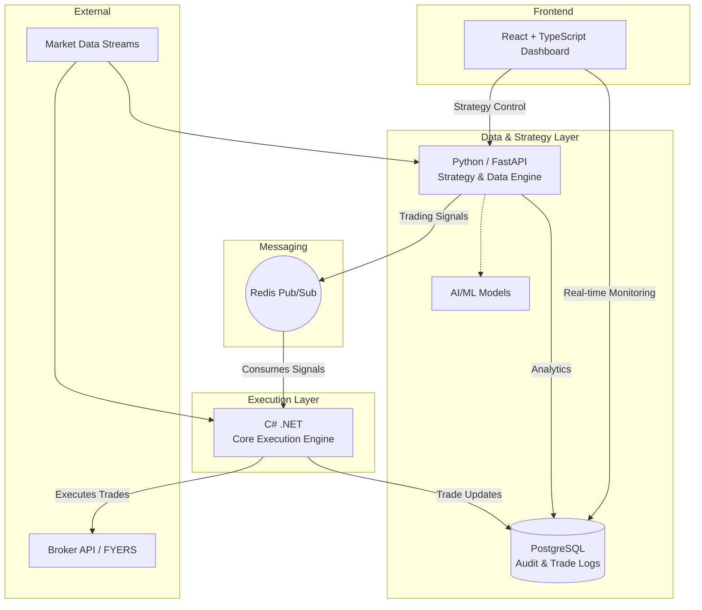

# Research & Architecture Report: Polyglot Algorithmic Trading Engine

## 1. Executive Summary
This document outlines the architectural foundation for a high-performance, algorithmic trading engine. Designed specifically for low-latency execution in derivatives markets (such as BankNifty and Sensex), this system adopts a **polyglot microservices architecture**. By isolating quantitative strategy logic from order execution, the platform delivers enterprise-grade scalability, real-time observability, and AI-ready data pipelines.

## 2. The Architectural Challenge in HFT
In High-Frequency Trading (HFT) and low-latency algorithmic trading, milliseconds dictate profitability. Traditionally, quantitative analysts and data scientists rely heavily on Python for its unparalleled data ecosystem (pandas, NumPy). However, Python faces inherent limitations in production execution environments:

* **The Global Interpreter Lock (GIL):** Python's GIL restricts true parallel execution of bytecode, which severely bottlenecks performance when microseconds matter.
* **Interpreted Overhead:** As an interpreted language, Python cannot match the raw execution speed of compiled languages when routing orders to exchange APIs.

To solve this, modern quantitative systems must bridge the gap between data science and low-level systems engineering.

## 3. Our Polyglot Solution
We solve the latency bottleneck by implementing a polyglot microservices environment. This approach utilizes the best language for each specific domain:

### Architecture Diagram

### Component Breakdown

#### A. Core Execution Engine: C# (.NET)
* **Purpose:** Handling ultra-low latency WebSocket streams from brokers (e.g., FYERS) and executing trades.
* **Rationale:** C# and the .NET framework are industry standards for building robust, high-performance algorithmic trading systems. By utilizing a compiled language for the execution layer, we ensure that order placement and kernel-level networking operations occur with minimal overhead, bypassing Python's GIL entirely.

#### B. Strategy & Data Engine: Python (FastAPI)
* **Purpose:** Processing historical data, running technical indicators, and hosting AI/ML inference models (such as predictive LLMs or anomaly detection agents).
* **Rationale:** Python remains the undisputed leader for machine learning and data workloads. Quants can develop and deploy strategies in this environment seamlessly.

#### C. The Communication Backbone: Redis Pub/Sub
* **Purpose:** Inter-process communication between the microservices.
* **Rationale:** To avoid tight coupling between the C# and Python services, we utilize a message broker pattern. Python publishes trading signals to a Redis queue, and the C# execution engine continuously polls and consumes these signals for instant processing.

#### D. Observability & Control: React + TypeScript
* **Purpose:** A heavily typed, real-time frontend dashboard.
* **Rationale:** Institutional clients require granular oversight. The React UI provides live P&L tracking, strategy toggling, and system health monitoring, backed by a **PostgreSQL** database for persistent trade logging and audit trails.

## 4. Business Value & Extensibility
This architecture is built for commercial extensibility. It allows for:

* **Horizontal Scaling:** As trading volume increases, the Python strategy nodes can be horizontally scaled independently of the C# execution node.
* **AI Integration:** The Python layer is purposely isolated to easily integrate advanced AI models for real-time market sentiment analysis or automated strategy orchestration.
* **Broker Agnosticism:** The C# execution layer is abstracted, meaning new broker APIs can be integrated without rewriting any quantitative strategy code.
