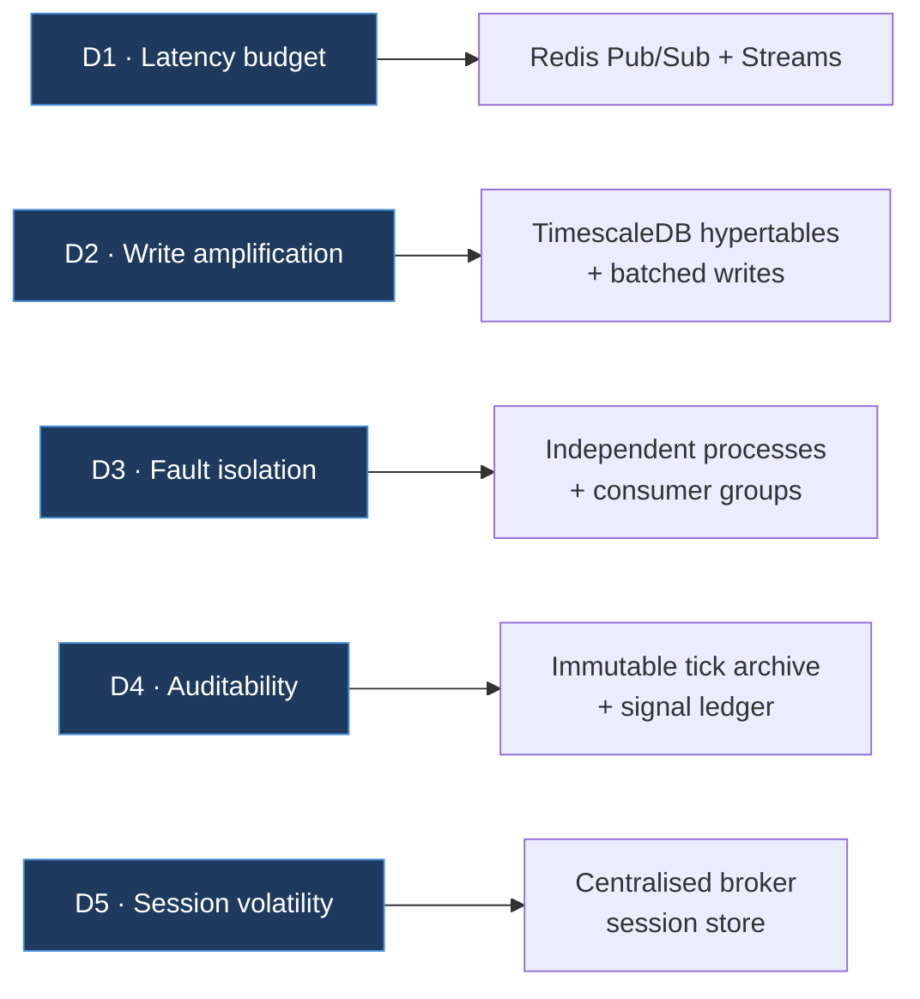
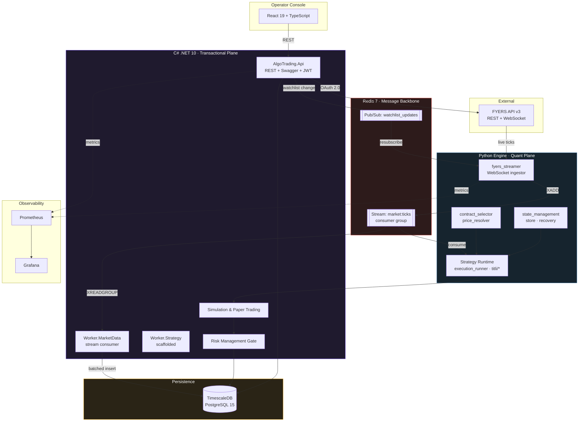
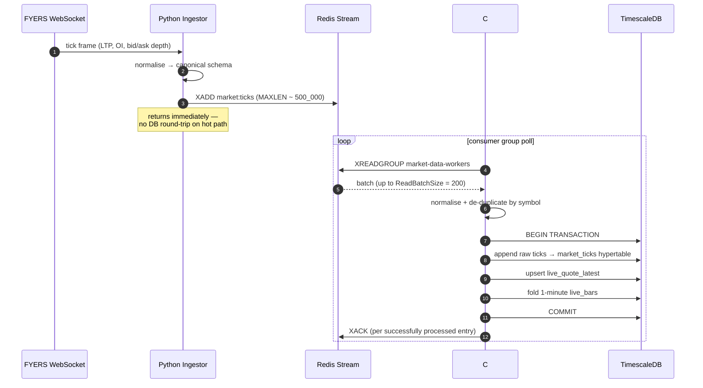
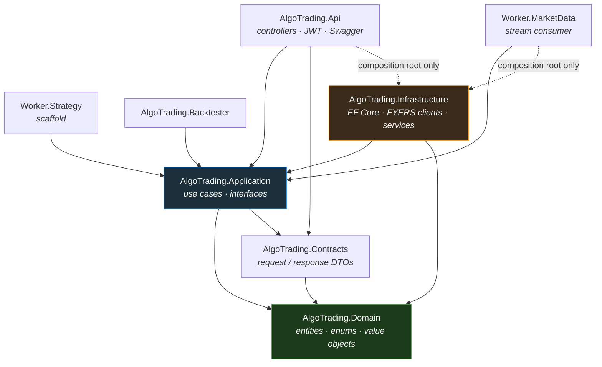
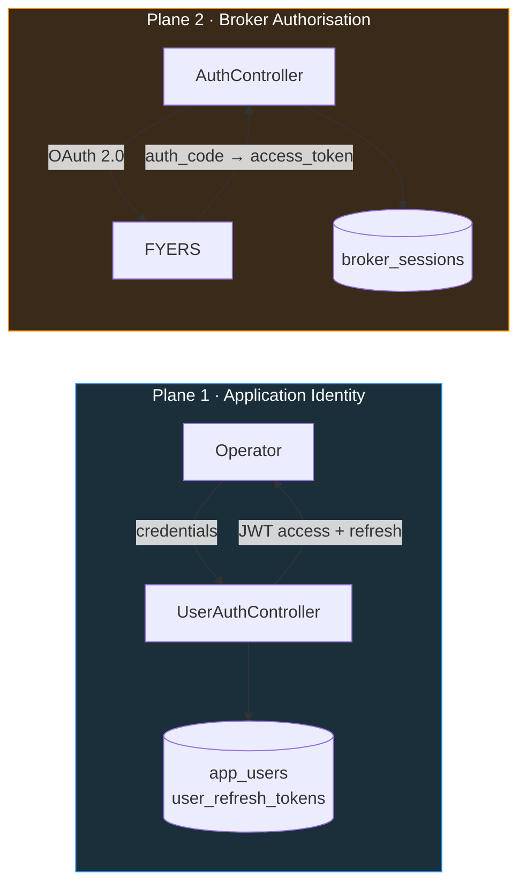
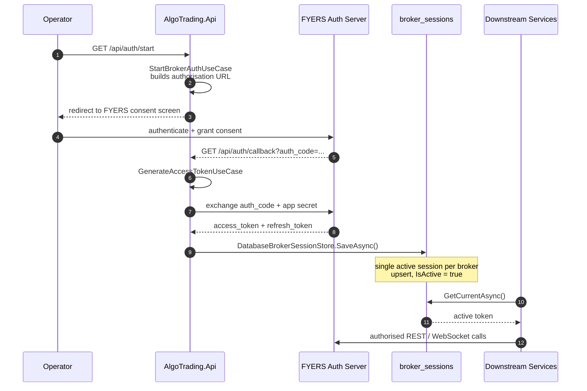
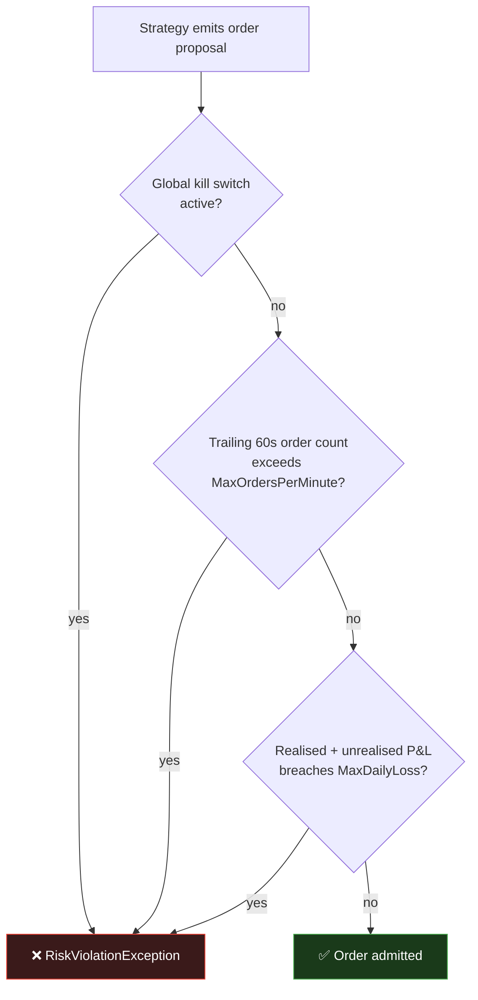
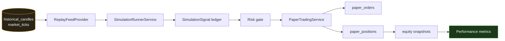

# Research & Architecture Report

### A Polyglot, Event-Driven Execution Engine for Indian Equity & Derivatives Markets


> **Author:** Upendra Singh Chauhan
> **Domain:** NSE / BSE — Index Options (BankNifty, Nifty, Sensex), Equity Cash, Derivatives
> **Broker Integration:** FYERS API v3
> **Document Type:** Technical Architecture & Design Rationale

---

## Table of Contents

1. [Executive Summary](#1-executive-summary)
2. [Architectural Drivers](#2-architectural-drivers)
3. [System Architecture](#3-system-architecture)
4. [Component Breakdown](#4-component-breakdown)
5. [Authentication & Session Management](#5-authentication--session-management)
6. [Risk Management & Capital Protection](#6-risk-management--capital-protection)
7. [Simulation, Replay & Paper Trading](#7-simulation-replay--paper-trading)
8. [Observability](#8-observability)
9. [Data Model](#9-data-model)
10. [Repository Layout](#10-repository-layout)
11. [Engineering Roadmap](#11-engineering-roadmap)
12. [Risk Disclaimer](#12-risk-disclaimer)

---

## 1. Executive Summary

This repository implements a **production-oriented algorithmic trading platform** for the Indian capital markets, built as a set of loosely coupled microservices communicating over a Redis message backbone and persisting to a TimescaleDB time-series store.

The system is deliberately **polyglot**. Rather than forcing a single language across the whole stack, each runtime is assigned the workload it is objectively best at:

| Runtime | Assigned Responsibility | Why This Runtime |
| :--- | :--- | :--- |
| **C# / .NET 10** | Transactional core, REST API, durable stream consumption, persistence, risk enforcement | Strong typing, mature EF Core data layer, low-allocation async I/O, first-class background-service hosting |
| **Python 3.11+** | Market-data ingestion, quantitative strategy logic, broker WebSocket handling | The FYERS SDK, plus the entire quant ecosystem (`pandas`, `numpy`), are Python-native |
| **React 19 / TypeScript** | Real-time operator dashboard | Rich, reactive visualisation of streaming market state |

### 1.1 Capability Matrix

An honest statement of maturity — what is implemented and running versus what is scaffolded or planned:

| Capability | Status | Notes |
| :--- | :--- | :--- |
| FYERS OAuth 2.0 session lifecycle | ✅ Implemented | Full authorisation-code flow with durable token persistence |
| Live tick ingestion via FYERS WebSocket | ✅ Implemented | Python ingestor with auto-resubscribe |
| Redis Streams transport (`market:ticks`) | ✅ Implemented | Consumer groups, explicit acknowledgement, capped stream |
| Durable tick archival to TimescaleDB | ✅ Implemented | Batched, transactional, hypertable-backed |
| Instrument master & option-chain resolution | ✅ Implemented | NSE CM + FO symbol masters, expiry rule engine |
| Historical candle sync & backfill | ✅ Implemented | Coverage tracking via `symbol_sync_state` |
| Paper trading & portfolio accounting | ✅ Implemented | Orders, positions, MTM, equity curve |
| Historical replay backtesting | ✅ Implemented | `ReplayFeedProvider` drives simulations from stored data |
| Pre-trade risk gate (kill switch, rate limit, daily loss) | ✅ Implemented | Enforced in `RiskManagementService` |
| Application authentication (JWT) | ✅ Implemented | Access + refresh token rotation |
| Prometheus / Grafana observability | ✅ Implemented | Custom trading metrics exported from both runtimes |
| React operator dashboard | ✅ Implemented | Live prices, option chain, DOM, P&L heatmap, latency gauge |
| Live order placement to broker | 🔶 Planned | Risk layer and paper engine are complete; broker order adapter is next |
| `AlgoTrading.Worker.Strategy` signal consumer | 🔶 Scaffolded | Host wired; signal subscription loop pending |
| Containerised application services | 🔶 Planned | Compose currently provisions infrastructure only |
| FastAPI control plane for the Python engine | 🔶 Planned | Engine currently runs as CLI-invoked processes |

---

## 2. Architectural Drivers

Every significant decision in this system traces back to one of five non-functional requirements characteristic of the Indian derivatives market.

**D1 — Latency budget.** Index option premiums on BankNifty and Sensex re-price on sub-second timescales. Any hop between ingestion and strategy evaluation must be measured in **microseconds to low milliseconds**, not in HTTP round-trips.

**D2 — Write amplification.** A modest watchlist of 200 instruments during peak volatility generates **tens of thousands of ticks per minute**. Naïve row-by-row inserts into a conventional RDBMS collapse under this load.

**D3 — Fault isolation.** A malformed payload, a strategy exception, or a dropped broker WebSocket must **degrade** the system, never halt it. Trading capital is exposed while a process is down.

**D4 — Auditability.** Every tick that informed a decision, and every decision taken, must be reconstructable after the fact — both for strategy research and for regulatory defensibility.

**D5 — Session volatility.** The FYERS access token expires **daily**. Every service that talks to the broker must obtain a valid token without manual intervention or a redeploy.



---

## 3. System Architecture

### 3.1 The Polyglot Rationale

A single-language stack would have been simpler to operate. It was rejected because the two halves of this problem have **irreconcilable optimisation targets**.

Quantitative strategy development is an *exploratory* discipline. It rewards fast iteration, notebook-driven experimentation, and access to a mature numerical ecosystem. It is also where the vendor SDK lives — FYERS ships `fyers_apiv3` for Python, and reimplementing its WebSocket protocol in another language would be gratuitous risk for zero strategic gain.

Order execution and state management are the opposite. They are *transactional* disciplines that reward compile-time guarantees, explicit concurrency control, and predictable memory behaviour. A mistyped field in a strategy notebook costs an afternoon; a mistyped field in an order router costs capital.

The architecture therefore places a **message broker at the seam** between the two, so that each side can be developed, tested, deployed, and scaled independently — and so that either side can be replaced without rewriting the other.



### 3.2 The Tick Lifecycle

The canonical hot path — from broker socket to durable storage — is fully asynchronous and contains no blocking database call on the ingestion side.



Three properties of this design are worth drawing out:

- **Back-pressure is bounded, not unbounded.** The stream is capped with `MAXLEN ≈ 500,000`. If the consumer stalls, the oldest ticks are evicted rather than exhausting Redis memory — a deliberate choice that favours *system survival* over *total completeness* for a data class that is already archived downstream.
- **Acknowledgement is explicit and per-entry.** `XACK` is issued only after the database transaction commits. A worker crash mid-batch leaves entries in the Pending Entries List, where a restarted or sibling consumer reclaims them. Ticks are not silently lost.
- **Writes are amortised.** One transaction absorbs up to 200 ticks and performs the archive append, the latest-quote upsert, and the 1-minute bar fold together — turning what would be hundreds of round-trips into one.

### 3.3 Why Redis

Redis was selected over a conventional broker (Kafka, RabbitMQ) after evaluating the workload's actual shape.

| Requirement | How Redis Satisfies It |
| :--- | :--- |
| Sub-millisecond fan-out | In-memory, single-threaded command loop; no disk fsync on the publish path |
| Durable, replayable consumption | **Streams** with consumer groups, Pending Entries List, and explicit `XACK` — at-least-once delivery without Kafka's operational weight |
| Ephemeral broadcast | **Pub/Sub** for fire-and-forget control messages (`watchlist_updates`) where replay is meaningless |
| Bounded memory under stall | `MAXLEN` capped streams |
| Operational simplicity | A single `redis:7-alpine` container — no ZooKeeper, no broker cluster, no partition rebalancing |

The dual use of **Streams for data** and **Pub/Sub for control** is intentional. A tick that arrives late is still valuable and must be replayable; a watchlist-change notification that arrives late is worthless and should not accumulate. Using one primitive for both would over-engineer the control path or under-engineer the data path.

> **Engineering note.** Kafka becomes the correct answer at multi-broker, multi-day-retention scale. At the current scale — one venue, one trading session, sub-second retention requirements — Redis delivers the needed semantics at a fraction of the operational cost. This is a documented trade-off, not an oversight.

### 3.4 Why TimescaleDB

Market data is time-series data with relational neighbours. Instruments, expiry rules, equity groups, users, and simulation runs are all naturally relational; ticks and candles are not. TimescaleDB resolves this tension without a second database.

**Hypertable partitioning.** The `market_ticks` table is converted into a hypertable partitioned on `ReceivedUtc` with **one-day chunks**:

```sql
SELECT create_hypertable(
    'market_ticks',
    'ReceivedUtc',
    chunk_time_interval => INTERVAL '1 day',
    migrate_data => true
);
```

This aligns the physical layout with the access pattern exactly. Indian markets trade a single continuous session per day, so a one-day chunk *is* a trading session. Backtest queries scoped to a date range touch only the relevant chunks; the planner excludes the rest before reading a single page.

**Why not a dedicated TSDB?** InfluxDB or ClickHouse would offer higher raw ingest ceilings. Both would also require the relational half of the domain — the instrument master, the option-chain expiry logic, the user and simulation tables, and their foreign keys — to live in a second system, with all the dual-write and consistency burden that implies. TimescaleDB is PostgreSQL: full SQL, full ACID, full EF Core support, and mature tooling, with time-series performance layered on top. For this workload, one correct database beats two fast ones.

---

## 4. Component Breakdown

### 4.1 The .NET Solution — Clean Architecture

The C# side is organised as a strict **Clean Architecture** solution. Dependencies point inward only; the domain knows nothing of the database, and the API knows nothing of EF Core.



| Project | Role |
| :--- | :--- |
| `AlgoTrading.Domain` | Pure business entities (`Instrument`, `MarketTick`, `PaperOrder`, `SimulationRun`, `ExpiryRule`, `BrokerSession`) and enums. Zero external dependencies. |
| `AlgoTrading.Application` | Use-case classes — one per operation — plus the interface contracts (`IMarketDataService`, `IRiskManagementService`, `IBrokerSessionStore`, `IReplayFeedProvider`) that Infrastructure implements. |
| `AlgoTrading.Contracts` | Versioned request/response DTOs shared with the frontend. Isolates the wire format from the domain model. |
| `AlgoTrading.Infrastructure` | EF Core `TradingDbContext`, 20+ migrations, entity configurations, FYERS REST/history clients, Redis publisher, and all concrete services. |
| `AlgoTrading.Api` | ASP.NET Core host. 14 controllers, JWT bearer authentication, Swagger with bearer security definition, Prometheus scrape endpoint. |
| `AlgoTrading.Worker.MarketData` | Background service hosting the Redis Streams consumer and the historical sync worker. |
| `AlgoTrading.Worker.Strategy` | Dedicated host reserved for the signal-consumption and execution loop. Currently a scaffold. |
| `AlgoTrading.Backtester` | Offline strategy evaluation harness. |

**The use-case pattern.** Rather than fat services, each operation is a single-responsibility class — `SyncHistoryUseCase`, `StartSimulationRunUseCase`, `UpsertLiveQuoteUseCase`, `GetSimulationEquityCurveUseCase`. Controllers do nothing but bind, delegate, and map. This keeps the API surface thin and makes each unit independently testable.

### 4.2 The Python Engine — Quant Plane

```
src/AlgoTrading.PythonEngine/
├── core/                     # configuration + Prometheus metric definitions
├── market_data/              # live/ (FYERS WebSocket), options/ (chain tracker), historical/
├── messaging/                # Redis Streams publisher / subscriber
├── state_management/         # durable strategy state, models, crash recovery
├── strategies/               # base strategy, contract selector, price resolver, runner
│   └── titli/                # concrete straddle strategy family
└── tools/                    # operational CLI utilities
```

**Ingestion (`market_data/live/fyers_streamer.py`).** Maintains the FYERS WebSocket, normalises inbound frames, and publishes to the Redis stream. It concurrently subscribes to the `watchlist_updates` Pub/Sub channel, so an operator adding a symbol through the API causes a live resubscribe with no process restart.

**Strategy runtime (`strategies/`).** A `base_strategy` contract with pluggable implementations. The `titli/` package holds a family of index-option straddle variants differentiated by strike offset and adjustment policy (20 / 50 / 70 / 90 / 175-point variants, plus a quantity-adjustment strategy). `contract_selector` resolves the tradeable option contract for a given spot and expiry; `price_resolver` derives the reference price used for entry and adjustment decisions.

**State management (`state_management/`).** Strategies are stateful — an open straddle has legs, adjustment history, and realised P&L that must survive a process restart. This package persists that state and provides a recovery path on startup, so a crashed strategy resumes rather than abandoning open positions.

### 4.3 The Operator Console — React 19

A Vite-built React 19 + TypeScript dashboard. Widgets are composed from a shared API client (`src/lib/api.ts`) against the .NET REST surface.

| Widget | Purpose |
| :--- | :--- |
| `LivePricesWidget` · `WatchlistWidget` | Streaming quote grid and watchlist management |
| `OptionChainWidget` | Strike ladder with expiry resolution |
| `DepthOfMarketWidget` | Level-2 bid/ask ladder |
| `PortfolioWidget` · `OrdersWidget` | Positions, MTM, and order blotter |
| `PnLHeatmap` | Per-symbol profit-and-loss distribution (d3) |
| `LatencyGauge` · `SystemObservabilityWidget` · `SystemStatusWidget` | Pipeline health, ingestion lag, service liveness |
| `SimulatorConfigWidget` | Backtest and paper-run configuration |
| `GlobalAlertsCenter` | Risk and system alert surface |

Stack: React 19, TypeScript 5.8, Vite 6, Tailwind CSS 4, Recharts + d3 for visualisation, Motion for transitions, Lucide for iconography.

### 4.4 Infrastructure Topology

`docker-compose.yml` (repo root) provisions the stateful backing services. Application services currently run on the host against these containers.

| Service | Image | Port | Role |
| :--- | :--- | :--- | :--- |
| `timescaledb` | `timescale/timescaledb:latest-pg15` | 5432 | Primary datastore, hypertable-backed |
| `redis` | `redis:7-alpine` | 6379 | Streams + Pub/Sub backbone |
| `redisinsight` | `redis/redisinsight:latest` | 8001 | Stream and key inspection |
| `prometheus` | `prom/prometheus:latest` | 9090 | Metric scraping (`host.docker.internal` bridged) |
| `grafana` | `grafana/grafana:latest` | 3000 | Provisioned dashboards and datasources |

---

## 5. Authentication & Session Management

The platform operates **two independent authentication planes**. Conflating them is a common design error; separating them is what allows the operator console to remain logged in across a broker token expiry.



### 5.1 Plane 1 — Application Identity (JWT)

Operators authenticate against the platform itself. `AuthService` hashes credentials with ASP.NET Core's `PasswordHasher<AppUser>` and issues a signed JWT alongside a persisted refresh token.

- **Access token:** short-lived bearer JWT, validated on issuer, audience, signing key, and lifetime, with a one-minute clock skew tolerance.
- **Refresh token:** persisted in `user_refresh_tokens`, enabling rotation and server-side revocation — a stolen access token expires on its own; a compromised session can be killed centrally.

### 5.2 Plane 2 — Broker Authorisation (OAuth 2.0)

The FYERS access token is **valid for a single trading day**. The platform automates the full authorisation-code exchange.



**Design decision — centralised session store.** The token is written once to the `broker_sessions` table behind the `IBrokerSessionStore` abstraction and read by every consumer that needs it. No service holds its own copy, and no service re-runs the OAuth dance. A single daily authorisation makes the entire fleet operational.

The abstraction is deliberate: `DatabaseBrokerSessionStore` is one implementation of `IBrokerSessionStore`. Substituting a Redis-backed cache — trading durability for read latency, with the database as write-through backing — is a configuration change in the composition root, not a refactor. That substitution is on the roadmap (§11).

---

## 6. Risk Management & Capital Protection

`RiskManagementService` implements a **pre-trade gate**. Every order proposal passes through `EvaluateOrderAsync` before it can reach an execution path, and a violation raises `RiskViolationException` rather than returning a status code — making the failure impossible to ignore by omission.



| Control | Mechanism | Rationale |
| :--- | :--- | :--- |
| **Global kill switch** | Static flag checked first, shared across all scoped service instances | A human operator must be able to halt every strategy instantly, without a deploy |
| **Order rate limiting** | Per-run `ConcurrentQueue<DateTime>` maintaining a sliding 60-second window | Contains runaway strategy loops and respects broker throttles |
| **Daily loss ceiling** | Aggregate P&L evaluated against a configured negative threshold | Enforces the single most important discipline in systematic trading — bounded daily drawdown |

The kill-switch and rate-limit state are held in `static` fields precisely because the service is registered as scoped: risk state must be **process-global**, not per-request. A per-request limiter would enforce nothing.

---

## 7. Simulation, Replay & Paper Trading

The platform can execute a strategy against historical data with the **same code path** used for live evaluation. This is the difference between a backtest that is informative and one that is merely reassuring.



| Component | Responsibility |
| :--- | :--- |
| `ReplayFeedProvider` | Streams stored candles/ticks as a synthetic live feed, preserving temporal ordering |
| `SimulationRunnerService` | Drives a run's lifecycle from `initial_capital` through to completion |
| `SimulationSignal` | Immutable ledger of every decision the strategy made, with its trigger context |
| `PaperTradingService` | Simulated fills, position accounting, mark-to-market valuation |
| `SimulationEquitySnapshot` | Time-ordered equity curve, the basis for drawdown and return metrics |
| Performance layer | Aggregate metrics exposed through `GetSimulationPerformanceUseCase` |

Because replay ticks are tagged, the archival path deliberately **excludes them** from the raw tick archive — simulation cannot contaminate the historical record that future simulations depend on.

---

## 8. Observability

Both runtimes export Prometheus metrics; Grafana consumes them through provisioned datasources and dashboards under `docker/grafana/`.

**Python engine** (`core/metrics.py`) — served from a daemon-thread HTTP server:

| Metric | Type | Signal |
| :--- | :--- | :--- |
| `algotrading_redis_lag_seconds` | Gauge | Delta between tick timestamp and processing time — **the primary pipeline health indicator** |
| `algotrading_ticks_processed_total` | Counter | Ingestion throughput |
| `algotrading_orders_emitted_total` | Counter | Strategy activity |
| `algotrading_strategy_loop_duration_seconds` | Histogram | Strategy evaluation latency distribution |

**.NET services** expose the standard `prometheus-net` surface — request rates, durations, GC and thread-pool behaviour — from the API host.

`algotrading_redis_lag_seconds` is the metric that matters most. In an event-driven pipeline, rising consumer lag is the earliest observable symptom of nearly every failure mode: a stalled consumer, a slow database, a network partition, or a volatility spike exceeding processing capacity. It is the first panel on the dashboard for that reason.

---

## 9. Data Model

Managed by EF Core with 20+ sequential migrations. Selected tables:

| Table | Purpose |
| :--- | :--- |
| `instruments` | NSE CM + FO symbol master, including strike, option type, and expiry metadata |
| `expiry_rules` | Declarative weekly/monthly expiry resolution with holiday-shift handling |
| `market_ticks` | **Hypertable.** Immutable raw tick archive, 1-day chunks |
| `live_quote_latest` | Hot upsert table — current quote per symbol |
| `live_ticks` · `live_bars` | Recent tick window and folded 1-minute OHLC bars |
| `historical_candles` · `symbol_sync_state` | Backfilled OHLC history with per-symbol coverage tracking |
| `live_watchlist_items` | Active subscription set driving ingestion |
| `equity_groups` · `equity_group_members` | Named instrument baskets for bulk watchlist operations |
| `broker_sessions` | Active broker OAuth tokens |
| `app_users` · `user_refresh_tokens` | Platform identity and session rotation |
| `simulation_runs` · `simulation_signals` · `simulation_equity_snapshots` | Backtest lifecycle, decision ledger, equity curve |
| `paper_orders` · `paper_positions` | Simulated execution and position state |
| `live_ingestor_status` | Ingestor heartbeat and liveness |

The `expiry_rules` table deserves specific mention. Indian index-option expiry is genuinely non-trivial — it varies by index, has shifted schedules repeatedly, and moves when expiry day falls on an exchange holiday. Encoding this as **data with a resolver service** (`ExpiryResolverService`, `ExpiryDayOfWeek`, `HolidayShiftRule`) rather than as conditional logic scattered through strategies means an exchange circular becomes a row update, not a code change and redeploy.

---

## 10. Repository Layout

```
AlgoTrading/
├── src/
│   ├── AlgoTrading.Domain/            # entities · enums · value objects
│   ├── AlgoTrading.Application/       # use cases · interfaces
│   ├── AlgoTrading.Contracts/         # API DTOs
│   ├── AlgoTrading.Infrastructure/    # EF Core · FYERS · Redis · services
│   ├── AlgoTrading.Api/               # REST host
│   ├── AlgoTrading.Worker.MarketData/ # stream consumer · historical sync
│   ├── AlgoTrading.Worker.Strategy/   # execution host (scaffold)
│   ├── AlgoTrading.Backtester/        # offline harness
│   └── AlgoTrading.PythonEngine/      # ingestion · strategies · state
├── algorithmic-trading-dashboard/     # React 19 + TypeScript console
├── tests/                             # unit · integration · backtest suites
├── docker/                            # compose · prometheus · grafana provisioning
└── docs/                              # architecture · deployment · risk guides
```

---

## 11. Engineering Roadmap

### Phase 1 — Close the Execution Loop `in progress`

- [ ] Implement the `trade_signals` Redis channel: Python publishes structured signals, `Worker.Strategy` consumes them
- [ ] Build the FYERS order adapter behind an `IOrderExecutionService` abstraction so paper and live share one interface
- [ ] Route live orders through the existing `RiskManagementService` gate — no separate live path
- [ ] Idempotent order submission keyed on a client order ID, to make broker-side retries safe

### Phase 2 — Containerisation & Deployment

- [ ] Multi-stage `Dockerfile` per .NET service (SDK build → runtime image)
- [ ] `Dockerfile` for the Python engine with pinned, hash-verified dependencies
- [ ] Extend Compose to orchestrate application services alongside infrastructure, with health checks and dependency ordering
- [ ] Version-pin all `:latest` image tags for reproducible builds
- [ ] CI pipeline: build, test, and image publication on push

### Phase 3 — Python Control Plane

- [ ] **FastAPI** service exposing strategy lifecycle control (start / stop / status / parameter update) over REST
- [ ] Migrate the engine to a DDD layout (`api/`, `core/`, `services/`, `models/`) as the surface grows
- [ ] Structured JSON logging with correlation IDs traced across the Redis boundary
- [ ] Pydantic schemas for every message crossing the language boundary — a typed contract between runtimes

### Phase 4 — Performance & Resilience

- [ ] Redis-backed broker session cache behind the existing `IBrokerSessionStore` interface
- [ ] TimescaleDB continuous aggregates for pre-computed multi-timeframe OHLC
- [ ] Compression and retention policies on the `market_ticks` hypertable
- [ ] Horizontal scale-out of the consumer group across multiple worker replicas
- [ ] Circuit breakers and exponential backoff on all FYERS API interactions

### Phase 5 — Quantitative Depth

- [ ] Real-time Greeks (delta, gamma, theta, vega) and implied-volatility surface
- [ ] Portfolio-level risk aggregation across concurrent strategies
- [ ] Walk-forward optimisation and parameter-sweep harness
- [ ] Slippage and market-impact modelling in the paper engine for realistic backtests
- [ ] ML-based regime detection to gate strategy activation

### Phase 6 — Operator Experience

- [ ] WebSocket or SSE push to the dashboard, replacing REST polling
- [ ] Strategy configuration and deployment from the console
- [ ] Alert routing to Telegram / email on risk-threshold breach
- [ ] Multi-user role-based access control

---

## 12. Risk Disclaimer

> **This software is provided for research and educational purposes.**
>
> Algorithmic trading in equity and derivatives markets carries substantial risk of financial loss. Derivatives are leveraged instruments; losses can exceed the initial capital deployed. Backtested or simulated performance is **not** indicative of future results and systematically omits real-world frictions including slippage, partial fills, latency, and liquidity constraints.
>
> Nothing in this repository constitutes financial advice or a recommendation to trade. Any deployment against a live brokerage account is undertaken **entirely at the operator's own risk**. Users are solely responsible for compliance with all applicable SEBI regulations, exchange bye-laws, and broker terms of service.
>
> **Always validate strategies in paper-trading mode across multiple market regimes before committing capital.**

---

## Appendix — Technology Stack

| Layer | Technology |
| :--- | :--- |
| Execution backend | C# / .NET 10, ASP.NET Core, EF Core |
| Quant engine | Python 3.11+, `fyers_apiv3`, `pandas`, `numpy` |
| Frontend | React 19, TypeScript 5.8, Vite 6, Tailwind CSS 4, Recharts, d3 |
| Message broker | Redis 7 (Streams + Pub/Sub) |
| Database | TimescaleDB on PostgreSQL 15 |
| Observability | Prometheus, Grafana, `prometheus-net`, `prometheus_client` |
| API documentation | Swagger / OpenAPI with JWT bearer scheme |
| Broker | FYERS API v3 (REST + WebSocket) |
| Orchestration | Docker Compose |

---

<div align="center">

**Maintained by Upendra Singh Chauhan**

*Building institutional-grade trading infrastructure for Indian markets.*

</div>
